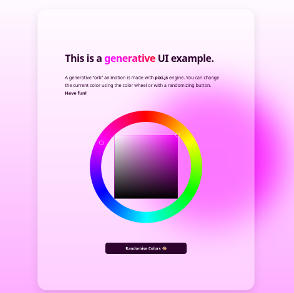

This is a example of a generative page powered by webgl background animation.
It's based on the [tutorial](https://dev.to/georgedoescode/create-a-generative-landing-page-webgl-powered-background-animation-3nl0) created by George Francis and built with [Next.js](https://nextjs.org/).

It uses [pixi.js](https://github.com/pixijs/pixijs) engine to render the org animation and [reinvented color wheel](https://github.com/luncheon/reinvented-color-wheel) to pick theme color.



## Getting Started

To try it, run the development server:

```bash
npm run dev
# or
yarn dev
```

or just build it and run

```bash
npm run build
npm run start
# or
yarn build
yarn dev
```

Open [http://localhost:3000](http://localhost:3000) with your browser to see the result.
